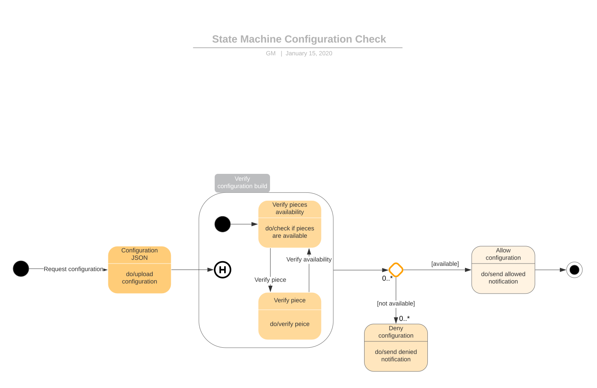
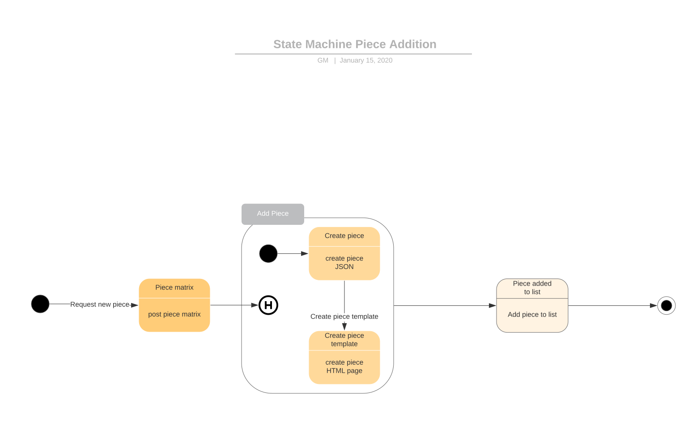
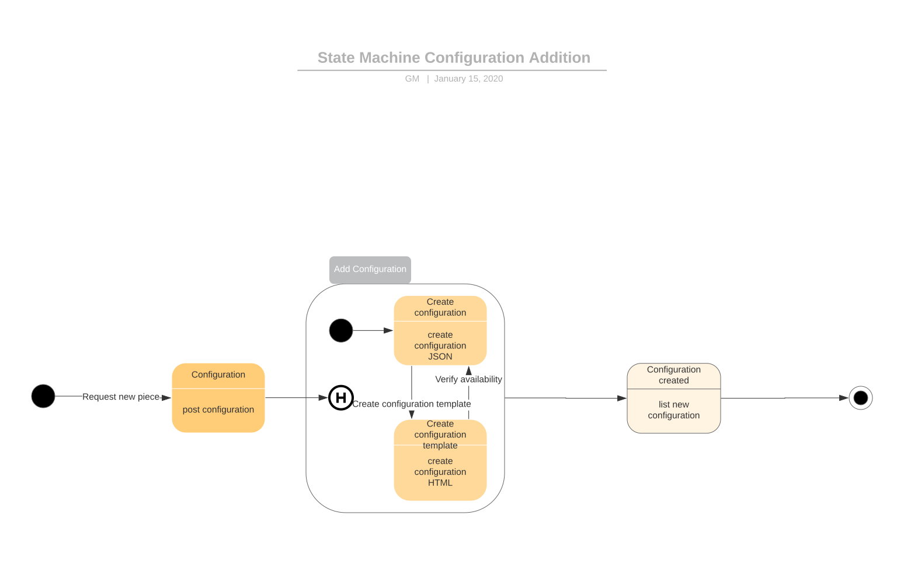

## Welcome

    This is the documentation page for Artificial Intelligence Final Project.

## Getting started
    Clone the project's repository and create a virtual python environment with all the packages from requirements.txt.
## Actions
    There are several actions supported through the interface. The UML diagrams below shows what happens in every case.

    

## Project layout

    docs/                                   # The mkdocs docs files.
        index.md                            # The documentation homepage.
    site/                                   # The mkdocs generated site.
        ...                                 # The mkdocs site's files and folders.
    web/                                    # Flask website of the project.
        static/                             # Site's static files (.css, images, .js).
            css/                            # Site's .css files.
                stylesheet.css              # Custom css for grid (add_piece.html page).
            images/                         # Site's images.
                favicon.ico                 # Project site's favicon.
            js/                             # Custom made .js scripts.     
                configuration.js            # Validation and actions for configurations.html page.         
                grid.js                     # Validation and actions for add_piece.html page.         
                upload.js                   # Validation and actions for add_configuration.html page.         
        templates/                          # Project's Flask site's files.
            public/                         # Site's structure accessible to users.
                resources/                  # Pages dinamically created from default structures or user additions.
                    configurations/         # Configurations files (.html) for default & user.
                        user_made/          # Configurations files (.json) for user.
                    pieces/                 # Pieces files (.html) for default & user.
                        user_made/          # Pieces files (.json) for user.
                add_configuration.html      # Add Lego configuration page.
                add_piece.html              # Add Lego piece page.
                configurations.html         # List of configurations (default & user) page.
                custom_configuration.html   # Configuration checker page.
                index.html                  # Main page.
                layout.html                 # Base layout for pages.
                pieces.html                 # List of pieces (default & user) page.
        uploads/                            # Configurations files (.json) uploaded by user.
    configuration.py                        # Configuration class & default configurations.
    cube.py                                 # Plotly cube coordinates.
    LICENSE                                 # Project's license file.
    main.py                                 # Flask initialization and routes.
    mkdocs.yml                              # The configuration file.
    piece.py                                # Piece class & default pieces.
    README.md                               # Project's Readme file.
    requirements.txt                        # Project's python dependencies.
        
